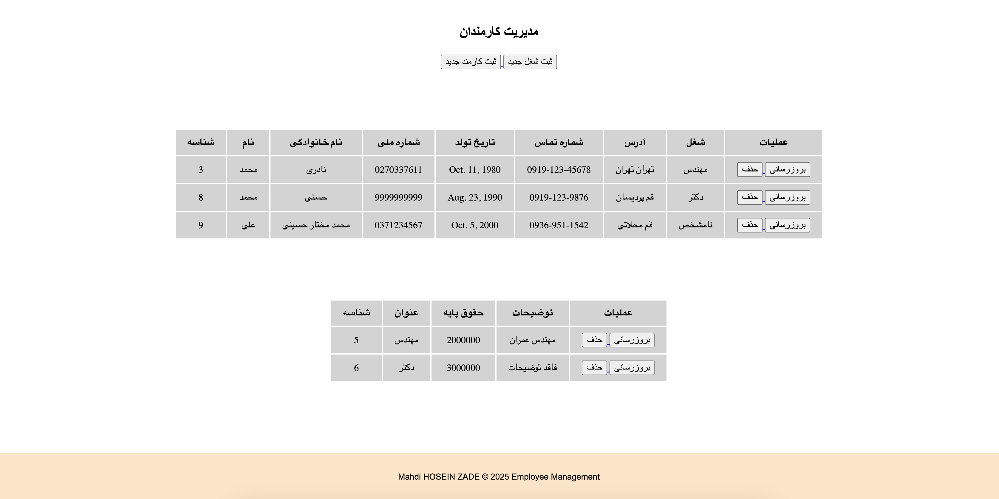

# Employee Management System


This is a simple Django-based web application for managing employee information and job details.

## Features

* **Employee Management:**
    * Add new employees with personal information (name, national ID, birth date, address, job).
    * View a list of employees with their details.
    * Update employee information.
    * Delete employee records.
* **Job Management:**
    * Add new job titles with basic salary and description.
    * View a list of job titles and their details.
    * Update job details.
    * Delete job records.

## Technologies Used

* **Python:** Programming language.
* **Django:** Web framework.
* **HTML/CSS:** Frontend structure and styling.
* **SQLite (default):** Database (you can change this to PostgreSQL, MySQL, etc.).

## Prerequisites

* **Python:** (Version 3.6 or higher recommended)
* **pip:** Python package installer.

## Setup Instructions

1.  **Clone the repository:**

    ```bash
    git clone [your-repository-url]
    cd [your-repository-directory]
    ```

2.  **Create a virtual environment (recommended):**

    ```bash
    python -m venv venv
    ```

    * **Activate the virtual environment:**
        * **Windows:** `venv\Scripts\activate`
        * **macOS/Linux:** `source venv/bin/activate`

3.  **Install django:**

    ```bash
    pip install django
    ```

    **( This project made with Django v5.1.6 )**

4.  **Apply database migrations:**

    ```bash
    python manage.py makemigrations
    python manage.py migrate
    ```

5.  **Create a superuser (admin account):**

    ```bash
    python manage.py createsuperuser
    ```

6.  **Run the development server:**

    ```bash
    python manage.py runserver
    ```

7.  **Access the application:**

    Open your web browser and go to `http://localhost:8000/`.

8.  **Access the admin panel:**

    Go to `http://localhost:8000/admin/` and log in with the superuser credentials you created.

## Usage

* **Employee Management:**
    * Use the "Add Employee" button to add new employees.
    * Click on an employee's name to view or edit their details.
    * Use the "Delete" button to remove an employee.
* **Job Management:**
    * Use the "Add Job" button to add new job titles.
    * Click on a job title to view or edit its details.
    * Use the "Delete" button to remove a job.

## Future Enhancements

* **Search and filtering:** Implement search and filtering functionality for employees and jobs.
* **User authentication:** Add user authentication and authorization for different roles (e.g., admin, manager).
* **Improved UI/UX:** Enhance the user interface and user experience.
* **Reporting:** Add reporting features for generating employee and job reports.
* **Database optimization:** Optimize database queries and performance.
* **Testing:** Implement unit and integration tests.

## Contributing

Contributions are welcome! If you find any bugs or have suggestions for improvements, please feel free to submit a pull request or open an issue.
Feel free to contribute to this project by submitting pull requests or opening issues.

## License

Apache License Version 2.0

## Copyright

Copyright &copy; 2025 Employee Management @aucnom
